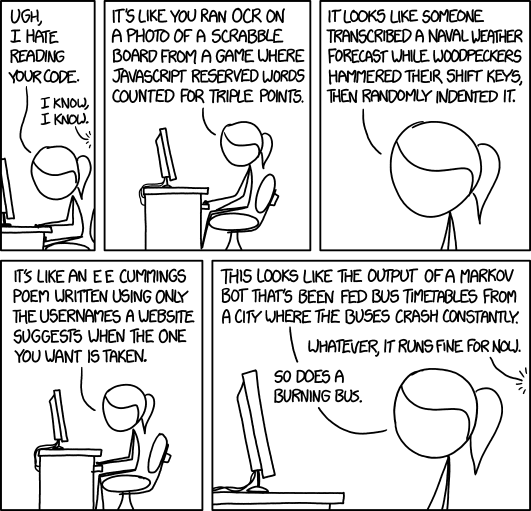

# `whoami`

<a href="https://github.com/ocefpaf"><i class="fab fa-github-alt"></i></a>
<a href="https://twitter.com/ocefpaf"><i class="fab fa-twitter"></i></a>
ocefpaf

. . .

# Reproducibility problem

~~Rather than a reproducibility crisis~~

<figure class="display">
    
  <figcaption><a href="https://www.nytimes.com/2013/04/19/opinion/krugman-the-excel-depression.html">
  https://www.nytimes.com/2013/04/19/opinion/krugman-the-excel-depression.html</a></figcaption>

# Could the notebook be a solution?

<iframe src="https://www.nature.com/news/interactive-notebooks-sharing-the-code-1.16261" width="750px" height="450px"></iframe>

[https://www.nature.com/news/interactive-notebooks-sharing-the-code-1.16261](https://www.nature.com/news/interactive-notebooks-sharing-the-code-1.16261)

# But which notebook?

<iframe src="https://www.theatlantic.com/science/archive/2018/04/the-scientific-paper-is-obsolete/556676" width="750px" height="450px"></iframe>

[https://www.theatlantic.com/science/archive/2018/04/the-scientific-paper-is-obsolete/556676](https://www.theatlantic.com/science/archive/2018/04/the-scientific-paper-is-obsolete/556676)

# Ocean sciences is way more difficult

Numerical model example

 >- data preprocessing provenance
 >- data assimilation techniques/parameters
 >- numerical model parameters

. . .

How to properly document all that so others can reproduce the simulation?

# What is reproducibility?

<figure class="display">
    
  <figcaption> Peng (2011) <a href="https://doi.org/10.1126/science.1213847">
  https://doi.org/10.1126/science.1213847</a></figcaption>
</figcaption>

# Discussion time

>- What measures do you take to ensure your analyses are:

  >- reproducible,
  >- replicable,
  >- robust?

. . .

Write your answers on the [etherpad <i class="far fa-edit"></i>](https://etherpad.wikimedia.org/p/ohw-discussion) and comment on the barriers, if any, you encountered?

[https://etherpad.wikimedia.org/p/ohw-discussion](https://etherpad.wikimedia.org/p/ohw-discussion)

. . .

<small>PS: shameless copied from the awesome tutorials available at:
[http://bitsandchips.me/Talks/PyCon.html](http://bitsandchips.me/Talks/PyCon.html)
and [http://bitsandchips.me/JNB_reproducible](http://bitsandchips.me/JNB_reproducible).
</small>

# Simple steps to reproducible research

>- <i class="fab fa-git-square"></i> record the project's provenance
>- <i class="fas fa-database"></i> data and metadata curation
>- <i class="fas fa-code-branch"></i> establish a testing/analysis workflow
>- <i class="fas fa-upload"></i> test, document, and publish your code...

. . .

<i class="fas fa-share-alt"></i> ... and share it!

# What are we going to do today?

>- <i class="fab fa-git-square"></i> ~~record the project's provenance~~
>- <i class="fas fa-database"></i> ~~data and metadata curation~~
>- <i class="fas fa-code-branch"></i> ~~establish a testing/analysis workflow~~
>- <i class="fas fa-upload"></i> **test, document, and publish your code!**

 # Why?

In research, experiments/results are not trusted unless:

- The experimental setup is tested
- The method is well-documented
- We can demonstrate that our results are reproducible and reliable

. . .

So why would scientific software be any different?

# Clear code is paramount

# As is good practices for the scientific env creation

# Introducing:

The **code** *test-document-publish* cookie cutter!

. . .

(Yep! Another cookie cutter for Scientific Python package!)

[https://nsls-ii.github.io/scientific-python-cookiecutter](https://nsls-ii.github.io/scientific-python-cookiecutter)

# We will need

<i class="fas fa-cookie"></i> [https://github.com/lsetiawan/rppc](https://github.com/lsetiawan/rppc) 
<i class="fab fa-github"></i> [GitHub account](https://github.com) 
 [Travis-CI account](https://travis-ci.org) 

# For the hack session

<i class="fas fa-terminal"></i> hands on... 
<i class="fab fa-python"></i> ... python package 
<i class="fab fa-osi"></i> choose a license https://choosealicense.com 
<i class="fas fa-laptop-code"></i> write doctest... 
<i class="fas fa-bug"></i> ... with a bug 
<i class="fas fa-flask"></i> fix test / <i class="fas fa-vial"></i> re-run  
<i class="fab fa-linux"></i> / <i class="fab fa-apple"></i> Travis-CI / CircleCI
<i class="fab fa-windows"></i> AppVeyor 
<i class="fas fa-cloud-upload-alt"></i> upload source dist and docs 
 DOI

# The End

